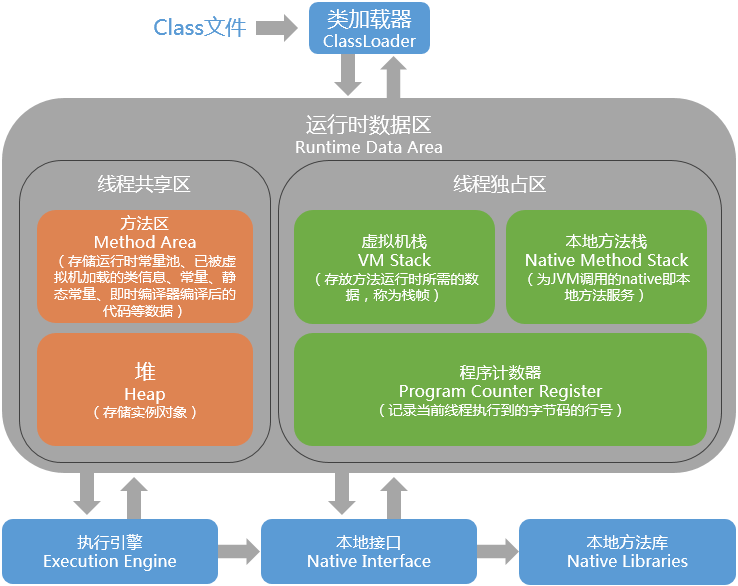

[TOC]

| 科目             | 起始时间 | 结束时间 | 备注                               |
| ---------------- | -------- | -------- | ---------------------------------- |
| 《32种设计模式》 | 20190508 | 20190613 | 学后后期时常回来看看，温故而知新。 |
|                  |          |          | ---------------------------------- |
| ---------------- | -------- | -------- | ---------------------------------- |
| ---------------- | -------- | -------- | ---------------------------------- |
| ---------------- | -------- | -------- | ---------------------------------- |
| ---------------- | -------- | -------- | ---------------------------------- |
| ---------------- | -------- | -------- | ---------------------------------- |
| ---------------- | -------- | -------- | ---------------------------------- |
| ---------------- | -------- | -------- | ---------------------------------- |
| ---------------- | -------- | -------- | ---------------------------------- |
| ---------------- | -------- | -------- | ---------------------------------- |

#  Gateway
	使用OpenRestry编写lua脚本对nginx进行扩展。
	还有另外一种，API Gateway，到时具体再研究。

1. 

# 技术选型

> 参考：https://blog.csdn.net/matthewei6/article/details/50513624

# 设计
## 设计原则 
	1.单一职责原则
	2.里氏替换原则
		子类作用大于父类；子类、父类返回类型一致；抛出异常只能抛出父类定义的异常；
	3.依赖倒置原则
	4.接口隔离原则
	5.迪米特法则
		一个实体应与其它实体尽量少的交互，降低依赖；
	6.开闭原则
		尽量使用合成、聚合结构，尽量少使用继承；
## 设计原则之隔离
	1. 线程隔离，如核心线程池，非核心线程等；
	2. 进程隔离，利用nginx分流，导向不对的进程（微服）处理；
	3. 集群隔离，按业务进行隔离部署；
	4. 机房隔离，若一组机房发生问题，可将流量全部切换其它机房服务组； 
	5. 读写隔离，即数据库服务进行隔离；
	6. 动静隔离，将静态代码与动态代码分离部署；
	7. 爬虫隔离，单独为爬虫进行部署；使用cookies验证等，有可能会误伤；
	8. 热点隔离，将并发高的业务代码进行封闭隔离，如秒杀等具体业务场景；
	9. 资源隔离，如磁盘等硬件信息进行隔离；

# 其它
	Spark替代springboot。https://www.jdon.com/51806
	AI/大数据场景中，数据统一分析引擎。

##  设计
### 设计框架
	MVC
	MVP
	MVVM: Model view/view model

## 扩展

	横向扩展 也叫 水平扩展，用更多的节点支撑更大量的请求。 如成千上万的蚂蚁完成一项搬运工作。	
	纵向扩展 又叫 垂直扩展，扩展一个点的能力支撑更大的请求。如利用1个人的能力，如蜘蛛侠逼停火车。
	
	引https://blog.csdn.net/kingmax54212008/article/details/72721772

>前端：android/Jquery/LayUI/ztree/echarts/
>开源框架：
>	  SpringBoot/hibernate/Mybatis
>	  redis/ActiveMQ/Solar/CAS
>规范等：
>	 JPA/设计模式/restful
>数据库: mysql/mongodb
>文档工具：swagger/markdown/excel
>系统: centerOS 7.5/XServer/docker/k8s/nginx/tomcat/
>开发平台：idea/eclipse/mac/ubuntu/windows/
>组件：lombok/
--------------------------
分布式的链路跟踪和监控 Dapper
ElasticSearch+Logstash+Kibana+Filebeats日志系统
Spring-cloud-stream-binder

架构：NIO/RPC
大数据：springCloud/es/Kafka/MC
Hadoop/hive 
spark mapreduce /flume /flink
Scala/Groovy/Clojure/KOTin/
人工智能：
机器学习：caffe/theano /keras/convnet/tensorflow/torch
算法：lr/adaboost/gmm/svm/crf/maxent/hmm/dnn/cnn/rnn/curennt
图像识别：
物体追踪:

物联网


## JAVA
web.xml
	监听器>过滤器>servlet

1. 监听器
    不对主流程进行设置，仅用于监听动作。
    实现方法：

  > implements  ServletContextListener 常用于对应监控application内置对象的创建和销毁。
  > implements  HttpSessionListener 常用于统计在线人数；
  > implements  ServletContextAttribtueEvent 常用于当访问某个页面时，出发一个request请求，执行requestInitialized方法；当页面关闭时，执行requestDestroyed方法。
  > implements  HttpSessionBindingListener 常用于Session数据的钝化与活化；

1. 过滤器
	配置对某些请求进行过滤，常用于编码。
	实现方法: implements Filter重写doFilter方法；
	原理：基于回调函数进行。
	
	> 执行顺序：
	过滤器A -> 过滤器B --> .... --> servlet,所以执行顺序与web.xml编写顺序有关。
	
1. 拦截器
    通常使用第三方，如：Spring AOP(Aspect Oriented Program)进行拦截设置。
    实现方法: @Aspect
    原理：使用java反射机制实现。

  > 是对OOP的一种补充，实现OO的平等面转换为立体面。实现原理是代理机制。

三者区别：
深度：过滤器仅在servlet前后执行，而拦截器不仅在前后，异常抛出后等均能捕捉； 
资源：拦截器(AOP)可在spring体系中的全部资源/对象等进行拦截，而过滤器却不支持；	

### jDK相关命令

```kotlin
//将编译的.class文件转汇编
#javap -c -v xx.class > a.txt
//查看jvm、系统等信息
#jinfo pid
//显示java线程pid
# jps

#visual vm
可以检测死锁；
```
### 线程安全

voliatile 修饰的变量目的是越过内存屏障，强制在内存中存取，即变量便有的线程可见、一致性。

内存屏障是cpu一般操作内存时，分为高速缓存L1/L2/L3和内存，在 硬件设计时，为保障各线程数据一致性，故增加 一层 ”缓存一致性协议“，即内存屏障。

## JVM

> https://www.jianshu.com/p/76959115d486 灰常不错的技术文章



数据（方法区、Heap）及指令(程序计数器、虚拟机栈、本地方法栈)。

**程序计数器**：多核CPU均拥有各自的线程，用于存储指令等信息；它是唯一没有OutOfMemoryErorr区域。

**虚拟机栈**：与程序计数器相同，当前线程所执行的输入、指令及返回地址；

​            其中包括局部变量表、操作数栈、动态链接、方法返回地址等；

**本地方法栈**：本地native方法服务（调用 c文件的服务）；

**堆：**所有线程共享的内存区域，所以多时候需要同步机制；

​         分为新生代、老年代；

**方法区：**与堆一样共享内存区域，用于加载类似、常量、静态变量等；

### jvm内存模型


**新生代/老年代/永久代**1.8后抛弃永久代为**元空间（Metaspace)**

| 空间大小 | 倍数              |
| -------- | ----------------- |
| 总大小   | 3-4倍活跃数据大小 |
| 新生代   | 1-1.5倍活跃数据大小       |
| 旧生代   | 2-3倍活跃数据大小           |
| 永久代   | 1.2-1.5倍Full GC后的永久代空间占用           |

如：假设GC日志获得老年代的活跃数据大小300MB，so各区设置为：总大小1.2G，新生代450MB,老年代1.2G-450MB=750MB。

### 新生代、老年代、永久代

新生代GC为**Minor GC**；老年代GC为**Major GC**；永久代存放元数据，如class/method等元信息与垃圾回收关系不大。

当整理新生代和老年代时，使用 **Full GC**（Minor+Major）。

### 触发条件

Full GC：当年老代被写满；蔌者持久代被写满；或者System.gc()被 显示调用；上一次GC之后的Heap的各域分配策略动态变化；

分配担保概念：Minor GC检查前，判断老年代最大可用连续空间是否大于新生代所有对象 总空间？

**新生代** 

新生代中含  一个Eden区、From Survivor区和To Survivor区，大部分对象 在Eden区，当Eden区满时，jvm将本区存活对象 移到Survivor区，对象每经历一次Minor GC,年龄+1，达到晋升年龄阈值时，将存活对象晋升至老年区。

| eden | From Survivor(s0) | To Survivor(s1) |
| ---- | ----------------- | --------------- |
| 8M   | 1m                | 1m              |
|      |                   |                 |

**老年代**

**MetaSpace**是在内存中进行分配，可动态扩容。为了防止1.8前永久代的溢出问题。而1.8前永久代是堆中。

Major GC通常使用“标记-清理、标记整理“等算法进行垃圾回收。
###  设置新堆大小
| 命令                | 说明                   |
| ------------------- | ---------------------- |
| -Xms20M             | starting，堆的起始大小 |
| -Xmx                | starting，堆的起始大小 |
| -Xmn                | new，堆的新生代的大小  |
| -XX:SurvivorRatio=8 | eden区大小            |
| -XX:MaxTenuringThreshold=1 |当垃圾回收时，s0区存活对象默认15个转入s1，设置为1时直接            |
|更多设置参照 | https://www.oracle.com/technetwork/java/javase/tech/vmoptions-jsp-140102.html<br />jdk13: https://www.oracle.com/technetwork/java/javase/tech/exactoptions-jsp-141536.html |

> 查看上述设置是否生效或者查看正在运行的系统实时状态：
>
> #jmap -heap pid
>
> 
>
> //第三秒进行刷新一下GC详细信息
>
> #jstat -gcutil pid 3000 
>
> 

### GC

gc关注是内存共享区，即堆和方法区。
##### 算法
**判断对象是否存活算法**

引用计数法算法：相互引用（a引用b,b引用a)、循环引用(a引用b)

```bash
优点:实现简单效率高
缺点：无法解决循环引用的问题，就是假如两个对象互相引用已经不会再被其它其它引用，导致一直不会为0就无法进行回收。
```

可达性分析算法: GcROOT

```bash
它的基本思路是通过一个称为“GC Roots”的对象为起始点，搜索所经过的路径称为引用链，当一个对象到GC Roots没有任何引用跟它连接则证明对象是不可用的。
```

>要真正宣告对象死亡需经过两个过程。
>1.可达性分析后没有发现引用链
>2.查看对象是否有finalize方法，如果有重写且在方法内完成自救[比如再建立引用]，还是可以抢救一下，注意这边一个类的finalize只执行一次，这就会出现一样的代码第一次自救成功第二次失败的情况。[如果类重写finalize且还没调用过，会将这个对象放到一个叫做F-Queue的序列里，这边finalize不承诺一定会执行，这么做是因为如果里面死循环的话可能会时F-Queue队列处于等待，严重会导致内存崩溃，这是我们不希望看到的。]

不可达是不是一定不回收？如final修饰的方法或变量。

**垃圾回收算法**

> 标记-整理算法、复制算法、、标记-清除算法；注：连续空间的碎片
>
> 

日志生成：

> java -jar xx.jar 
>
> -Xloggc:/data/gc.log    
>
> -XX:-UseGCLogFileRotation # 
>
>  -XX:GCLogFileSize=8K

YongGC日志：


FullGC日志：


##  数据库

### Mysql
#### 引擎

1. innodb  
B-Tree原理：键值/指针/数据，每个节点占用一个盘块的磁盘空间，一个节点上有两个升序排序的关键字和三个指向子树根节点的指针，指针存储的是子节点所在磁盘块的地址。
参考：https://blog.csdn.net/gitchat/article/details/78787837
B+Tree原理：通常在 B+Tree 上有两个头指针，一个指向根节点，另一个指向关键字最小的叶子节点，而且所有叶子节点（即数据节点）之间是一种链式环结构。

因此可以对 B+Tree 进行两种查找运算：一种是对于主键的范围查找和分页查找，另一种是从根节点开始，进行随机查找。

1. Myisam  
引擎也是采用的 B+Tree 结构来作为索引结构

### 深入  
参考： 

	https://blog.csdn.net/qq_36807862
	https://blog.csdn.net/qq_36807862/article/details/81289811
	https://www.cnblogs.com/chiangchou/p/mysql-8.html

### mysql优化


> 参考：http://blog.51cto.com/7038006/2065724  
> 参考:https://blog.csdn.net/xueji2012/article/details/80570049  


1. MySQL 性能优化：组成、表的设计
	开启查询缓存。避免某些 SQL 函数直接在 SQL 语句中使用，从而导致 Mysql 缓存失效。
	避免画蛇添足。目的是什么就取什么，例如某个逻辑是只需要判断是否存在女性，若是查到了一条即可，勿要全部都查一遍，此时要善用 limit。
	建合适的索引。所以要建在合适的地方，合适的对象上。经常操作 / 比较 / 判断的字段应该建索引。
	字段大小合宜。字段的取值是有限而且是固定的，这种情况下可以用 enum，IP 字段可以用 unsigned int 来存储。
	表的设计。垂直分割表，使得固定表与变长表分割，从而降低表的复杂度和字段的数目。

1. SQL 语句优化：避免全表扫描
	建索引：一般在 where 及 order by 中涉及到的列上建索引，尽量不要对可以重复的字段建索引。
	尽量避免在 where 中使用 !（<>）或 or，也不要进行 null 值判断。
	尽量避免在 where 中对字段进行函数操作、表达式操作。
	尽量避免使用 like- %，在此种情况下可以进行全文检索。


#SpringBoot
默认Spring框架实现会从声明@ComponentScan所在类的package进行扫描。


# redis
## 透传
指查询一个缓存中不存在的数据，需要从数据库中查询，数据库查询也不存在，这个现象是透传。
* 处理机制
使用bloom过滤器便可解决。布隆过滤器是将所有可能存在的数据HASH存在到一个足够大的bitmap中，一个一定不存在的数据会被bitmat拦截掉，从而避免对底层数据库的查询。详细实现方法见下方。
## 雪崩处理
雪崩是一段时间内发生了大量的透传，对redis造成了雪崩。

* 处理机制
1. 使用**布隆过滤器机制**进行处理。如：

   ```
     BloomFilter filter =  BloomFilter.create(Funnels.integerFunnel(),1000000);//存放一百万的KEY，用于后续的判断，大小依据实际业务进行设置。
     filter.put("aadf");
    if (filter.mightContain("aaf")) {
    //已匹配
    } else {
    //无匹配
    }
    //BloomFilter 依赖com.google.common.hash.BloomFilter
   ```
原理是使用hash做为key的一个bitmap，默认0.3%的。

1. 使用**双层缓存**进行处理。如：

   ```
     	最上层设置带有过期标志的缓存；
     	第底层设置长期；
   ```
# 场景

## 权限相关处理
shiro /security/ oauth2

### OAUTH2
四种认证方式
1. 授权码模式，使用token+过期进行验证。
2. 简化模式，直接使用token进行验证。
3. 密码模式，使用username/password获得票据token.
4. 客户端模式，类似微信公众号开发。

## 秒杀
针对秒杀场景，系统设计时，

### 前端处理：
       1，减少不必要的网络请求，可设置较验码等方式进行后端减压，前端缓存静态资源，防止重复提交，限制session/token等等某段时间内的访问次数等；
       2，设置IP黑名单，在单位时间内访问次数过多，拉至黑名单；
       3，设置第二层减压，在nginx中设置最动、静分离和限制 
### 中间代理层处理
   	1，在nginx中设置动静分离，常见静态文件放在nginx中，动态tomcat中；
   	2，限流，如nginx设置最大连接数；其中nginx常用的限流两种算法进行实现:
   	a. 令牌桶算法
   	b. 漏桶算法
   	两种区别，用时再具体详细分析。

### 后端处理

 1. 设计秒杀业务与其它业务分离，单独放在高配服务器；

 2. 使用队列进行缓存，待处理完后返回用户订购成功；

 3. 对数据库的操作，可采用读、写分离；

``` java
另外一种方案：

a. 第一层判断页面传来的订单数与库存数；
b. 第二层进入redis进行真实的判断；
c. 利用redis进行原子操作，redis watch进行监控修改的订单和库存并开启事务，然后进入真实的业务处理；
d. 还可设计营销策略，执行某一地区允许固定数目的订单等；

jedis.watch(amoutId,ordersId);// 若事务执行之前key的值被其他命令所改动，那么事务将被打断
int prdNum = Integer.parseInt(jedis.get(amoutId));
if (this.allowProductAmout(prdNum, orders)) { //再次判断库存、订单
	Transaction transaction = jedis.multi();
	....
	transaction.exec();
}
```
